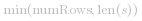
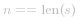
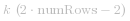
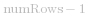
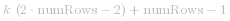
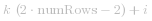
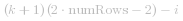

[TOC]

## Solution
---

#### Approach 1: Sort by Row

**Intuition**

By iterating through the string from left to right, we can easily determine which row in the Zig-Zag pattern that a character belongs to.

**Algorithm**

We can use   lists to represent the non-empty rows of the Zig-Zag Pattern.

Iterate through *s* from left to right, appending each character to the appropriate row. The appropriate row can be tracked using two variables: the current row and the current direction.

The current direction changes only when we moved up to the topmost row or moved down to the bottommost row.

```
class Solution {
public:
    string convert(string s, int numRows) {

        if (numRows == 1) return s;

        vector<string> rows(min(numRows, int(s.size())));
        int curRow = 0;
        bool goingDown = false;

        for (char c : s) {
            rows[curRow] += c;
            if (curRow == 0 || curRow == numRows - 1) goingDown = !goingDown;
            curRow += goingDown ? 1 : -1;
        }

        string ret;
        for (string row : rows) ret += row;
        return ret;
    }
};
```

**Complexity Analysis**

* Time Complexity: *O(n)*, where  
* Space Complexity: *O(n)*

<br/>

---

#### Approach 2: Visit by Row

**Intuition**

Visit the characters in the same order as reading the Zig-Zag pattern line by line.

**Algorithm**

Visit all characters in row 0 first, then row 1, then row 2, and so on...

For all whole numbers *k*,

- Characters in row *0* are located at indexes  
- Characters in row   are located at indexes  
- Characters in inner row *i* are located at indexes   and  .

```
class Solution {
public:
    string convert(string s, int numRows) {

        if (numRows == 1) return s;

        string ret;
        int n = s.size();
        int cycleLen = 2 * numRows - 2;

        for (int i = 0; i < numRows; i++) {
            for (int j = 0; j + i < n; j += cycleLen) {
                ret += s[j + i];
                if (i != 0 && i != numRows - 1 && j + cycleLen - i < n)
                    ret += s[j + cycleLen - i];
            }
        }
        return ret;
    }
};
```

**Complexity Analysis**

* Time Complexity: *O(n)*, where  . Each index is visited once.
* Space Complexity: *O(n)*. For the cpp implementation, *O(1)* if return string is not considered extra space.